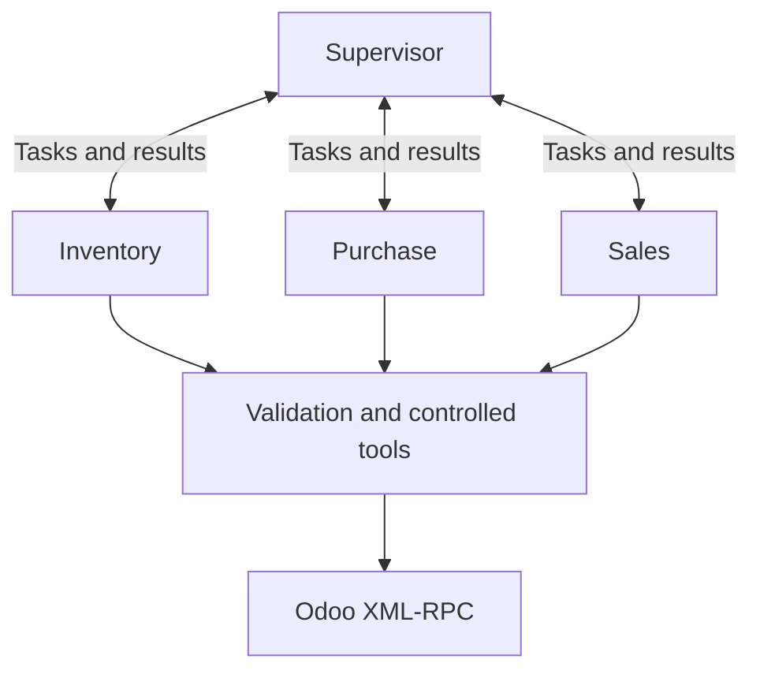

# ERP_BAR

A multi-agent order-fulfillment demo that connects local language models to Odoo. A supervisor coordinates Sales, Inventory, and Purchase agents to fulfill a customer request, while a browser dashboard shows agent activity and streamed model text. The main dashboard automatically shows a camera preview and uses a held smile to start one order. An optional second computer follows the real Odoo records.

**Camera on A update (2026-10-07):** Start with [README_CAMERA_ON_A.md](README_CAMERA_ON_A.md) for automatic camera startup, local smile detection and the compact three-panel layout. The older B-camera setup is still available with `--no-camera` on A.

**Base coordinated release: 2026.10.05.1 · protocol 2.** For the automatic two-computer kiosk, start with [README_REALTIME_KIOSK.md](README_REALTIME_KIOSK.md). Update A and B together; the release includes `Start-A.ps1` and `customer_screen/Start-B.ps1` launchers.

> **Live mode changes Odoo records.** It can create and confirm purchase/sales orders and validate receipts and deliveries. Use a dedicated demo/test database. The procurement flow simulates supplier fulfillment by validating the receipt; it does not establish that physical goods have arrived.

## Contents

- [How it works](#how-it-works)
- [Requirements](#requirements)
- [Quick start: dashboard demo](#quick-start-dashboard-demo)
- [Configure Ollama and Odoo](#configure-ollama-and-odoo)
- [Run a live mission](#run-a-live-mission)
- [Dashboard controls](#dashboard-controls)
- [Camera and Odoo on a second computer](#camera-and-odoo-on-a-second-computer)
- [Business policies](#business-policies)
- [Command-line options](#command-line-options)
- [Tests and verification](#tests-and-verification)
- [Project layout](#project-layout)
- [Local state and recovery](#local-state-and-recovery)
- [Troubleshooting](#troubleshooting)
- [Scope and limitations](#scope-and-limitations)
- [References](#references)

## How it works

1. A customer smiles at A’s dashboard camera to request one unit of the configured product, or opens Manual order to enter a product and quantity. The previous B-camera mode is optional.
2. The supervisor assigns work to the appropriate specialist.
3. Inventory identifies the product and checks unreserved stock in the configured warehouse.
4. If stock is insufficient, Purchase selects an existing supplier, purchases the shortage within policy, and completes the demo receipt flow. Inventory then verifies stock again.
5. Sales creates and confirms the customer order after the required stock and pricing checks. The workflow validates the full delivery and stops.
6. If a step cannot be completed, the failure path prepares a customer-facing response and preserves the recorded outcome of completed steps.



| Component | Responsibility |
| --- | --- |
| Supervisor | Routes work using mission state and agent results. |
| Inventory | Identifies the product, checks warehouse stock, and verifies availability after receipt. |
| Purchase | Resolves suppliers and performs permitted procurement steps. |
| Sales | Handles the customer request, sales order, fulfillment, and final customer response. |
| Runtime and tools | Parse and validate model proposals, enforce policy, call Odoo, and publish workflow events. |

Agents use a propose → validate → execute → observe loop. Model output is a proposal; only validated tool calls can change Odoo. The dashboard distinguishes generated text, proposed actions, tool execution, and results.

The main stack is Python, LangGraph, LangChain/Ollama, Pydantic, and a browser UI served by the application. The companion uses MediaPipe, OpenCV, and Playwright. There is no separate frontend build step.

## Requirements

| Component | Requirement |
| --- | --- |
| Main agent application | Python **3.14+**, as declared in the root `pyproject.toml`. |
| Optional B companion | A **separate Python 3.12 environment**; its supported range is Python 3.11–3.12. |
| Dependency management | [uv](https://docs.astral.sh/uv/getting-started/installation/). |
| Live model inference | A running [Ollama](https://ollama.com/) server and a downloaded model. The examples use `qwen3:1.7b`. |
| Live ERP operations | A reachable Odoo instance with XML-RPC access and the required Sales, Purchase, and Inventory functionality. |
| Camera on A | Webcam and current Chrome/Edge; browser permission and first-run model download. No native camera Python packages. |
| Optional B display | Separate companion environment and Playwright Chromium. Native MediaPipe/OpenCV are used only when B owns the camera. |
| Two-computer operation | A trusted private network; the companion must reach the main computer and Odoo. |

The repository does not install or provision Odoo, its database, or Ollama. Available memory and model speed depend on the selected model and computer.

Commands below assume **Windows PowerShell** unless marked otherwise. Run main commands from the repository root. Do not reuse the root `.venv` for the camera application.

## Quick start: dashboard demo

Clone or download this repository, then open a terminal in its `ERP_BAR` directory.

Install uv if necessary:

```powershell
winget install --id=astral-sh.uv -e
```

Open a new terminal after installation, then run:

```powershell
uv python install 3.14
uv sync --python 3.14 --locked
uv run python run_agent_view.py --demo
```

Open **http://127.0.0.1:8765** if the browser does not open automatically. Allow camera access and hold a smile to start, or expand **Manual order**. Watch the agent diagram and chat. First launch downloads the browser detector; see [camera setup](README_CAMERA_ON_A.md).

**Demo mode uses simulated workflow events and model text. It does not call Ollama or Odoo and does not require `.env`.** It is also the default when neither `--demo` nor `--live` is supplied.

Keep the terminal open while using the dashboard. Press `Ctrl+C` to stop the server. The application entry point is `run_agent_view.py`; `main.py` is a placeholder.

On macOS/Linux, install uv using its official installation guide; the `uv` commands above are the same.

## Configure Ollama and Odoo

### 1. Start Ollama and download a model

Install Ollama, then download the example model:

```powershell
ollama pull qwen3:1.7b
ollama list
```

If the Ollama application/service is not already running, start it in a separate terminal:

```powershell
ollama serve
```

A quick model check is:

```powershell
ollama run qwen3:1.7b "Reply with a short greeting."
```

The default server URL is `http://localhost:11434`. Keep the server running during live missions. The app requests JSON proposals and separates the model's optional thinking field from the JSON used for execution.

### 2. Prepare the Odoo demo database

Before a live run, configure:

- Sales, Purchase, and Inventory functionality, with warehouse receipt and delivery operations available.
- An existing walk-in customer and the warehouse used by the workflow.
- A uniquely identifiable product, preferably with a unique internal reference/SKU, suitable for stock tracking.
- Positive purchase cost and compatible sales/purchase units and currencies.
- An existing supplier and supplier price for the product if the mission will require purchasing.
- An Odoo user with permissions for the relevant products, partners, supplier information, purchase orders, sales orders, stock movements, and transfers in the intended company.

Find the existing customer, warehouse, and product IDs through Odoo's developer tools/record information. IDs in the example below are placeholders and must be replaced.

The bridge uses Odoo XML-RPC and concrete model fields, including `stock.move.quantity`. Compatibility with your Odoo version, installed modules, routes, and customizations must be checked; this project does not claim support for every Odoo release.

### 3. Create the root `.env`

Create `.env` beside `run_agent_view.py`. The checked-in `.env.example` contains only the basic Ollama settings; use the complete example below for live operation:

```dotenv
OLLAMA_BASE_URL=http://localhost:11434
OLLAMA_MODEL=qwen3:1.7b
OLLAMA_REASONING=true

ODOO_URL=http://localhost:8069
ODOO_DB=your_demo_database
ODOO_USER=your_odoo_login
ODOO_PASSWORD=your_odoo_password
ODOO_WALK_IN_CUSTOMER_ID=10
ODOO_WAREHOUSE_ID=1

# Optional for the dashboard; required by the read-only diagnostic scripts.
ODOO_PRODUCT_TEMPLATE_ID=15

# Optional procurement policies; see Business policies below.
ERP_BAR_PURCHASE_BUFFER_BY_PRODUCT={}
ERP_BAR_SUPPLIER_BY_PRODUCT={}
```

| Variable | Purpose |
| --- | --- |
| `OLLAMA_BASE_URL` | Ollama endpoint; defaults to `http://localhost:11434`. |
| `OLLAMA_MODEL` | Required for live/model-backed operation; must match an installed model tag. |
| `OLLAMA_REASONING` | `true` (default), `false`, or `auto`. Thinking output depends on the model and server. |
| `ODOO_URL` | Odoo base URL, without `/web` or login credentials. |
| `ODOO_DB` | Exact database name. |
| `ODOO_USER`, `ODOO_PASSWORD` | Credentials accepted by the instance's XML-RPC authentication. |
| `ODOO_WALK_IN_CUSTOMER_ID` | Existing `res.partner` ID used as the customer. |
| `ODOO_WAREHOUSE_ID` | Existing `stock.warehouse` ID used for stock and fulfillment. |
| `ODOO_PRODUCT_TEMPLATE_ID` | `product.template` ID used by diagnostic scripts and the CLI runner when no product query is supplied. |
| `ERP_BAR_PURCHASE_BUFFER_BY_PRODUCT` | Optional JSON mapping from **product variant IDs** to allowed extra procurement quantities. |
| `ERP_BAR_SUPPLIER_BY_PRODUCT` | Optional JSON mapping from exact product queries to operator-supplied supplier profiles. |

**Product template IDs and product variant IDs are different.** `ODOO_PRODUCT_TEMPLATE_ID` uses `product.template`; purchase-buffer keys use `product.product`. The dashboard accepts a product query such as a unique name or SKU.

Existing shell environment variables can override `.env` values. Restart the application after changing configuration. Keep `.env` private.

### 4. Run read-only connection checks

From the repository root, with `.env` configured:

```powershell
$env:PYTHONPATH = "src"
uv run python test_real_odoo_connection.py
uv run python test_warehouse_stock.py
```

For Bash, use `export PYTHONPATH=src` before the same commands.

These scripts inspect the configured Odoo connection, records, vendors, and warehouse stock. They do not create orders. Both use `ODOO_PRODUCT_TEMPLATE_ID`.

## Run a live mission

Start the dashboard:

```powershell
uv run python run_agent_view.py --live
```

At **http://127.0.0.1:8765**, enter the exact product name/SKU and quantity, then click **Start live mission**.

For a basic check, request one unit of a product with sufficient unreserved stock. For a procurement demonstration, use a dedicated demo product with insufficient available stock and an existing supplier/price.

Expected successful results:

- The requested product and quantity are verified.
- A shortage causes procurement and receipt, followed by a new stock check.
- One customer sales order is created and confirmed for the requested quantity.
- The full delivery is validated and the mission reaches `DELIVERED`.
- The workflow stops after delivery; it does not create an invoice or payment.

Stock means **physical quantity minus reserved quantity in the configured warehouse stock location**. For example, physical stock of 1 with 1 reserved means 0 available for this mission.

To run the same live workflow from the terminal:

```powershell
uv run python test_real_odoo_graph.py --product-query "Lemonade" --quantity 1
```

Despite its filename, this command performs real Odoo writes. Without `--product-query`, it resolves the product from `ODOO_PRODUCT_TEMPLATE_ID`. A successful verification prints `LIVE ODOO WORKFLOW PASSED`.

## Dashboard controls

The dashboard uses a single-page layout:

- **Left:** always-visible camera and smile meter, expandable manual order, mission details and playback/reading controls.
- **Middle:** supervisor and specialist diagram, communication/activity indicators, current action in the corresponding agent bubble, and mission outcome.
- **Right:** per-agent model text, revealed progressively with a typing cursor and automatic scrolling. The generated JSON proposal and final customer response are not displayed as right-panel chat messages.

Demo and live use the same presentation. Demo text is simulated; live text comes from the configured model's thinking stream when it emits one. Generated text is explanatory model output, not proof that an ERP action succeeded; use the tool results and mission outcome for that.

Reading speeds are **0.5×, 1×, 2×, and 4×**. Pause and slower playback help viewers follow the conversation. In live mode, these controls affect the **display only**: agents and Odoo actions continue. Use **Jump to latest** to catch up when the view is showing earlier events.

Closing the browser does not cancel an accepted mission.

## Camera and Odoo on a second computer

**Optional legacy B-camera setup.** The camera now runs on A by default. To keep A’s camera and use B only for Odoo, follow [README_CAMERA_ON_A.md](README_CAMERA_ON_A.md). The examples in this section use `--no-camera` on A to select the previous B-camera flow.

Computer A runs the agents and main dashboard. Computer B runs the webcam interface and opens the real Odoo website beside it. Ollama normally runs on A; Odoo may run on A or another reachable host.

| Service | Default address/port | Who needs access |
| --- | --- | --- |
| Main dashboard | `127.0.0.1:8765` on A | Browser on A only. |
| Optional paired API | A's private IPv4 address, port `8766` | Companion on B. |
| Customer screen | `127.0.0.1:8770` on B | Browser on B only. |
| Ollama | `localhost:11434` by default | Main application on A. |
| Odoo | Your configured base URL | Main application on A and Odoo browser on B. |

The split screen uses **two real browser windows**, not an embedded iframe. Agent tools make the ERP changes; the Odoo window opens and refreshes the relevant records. It does not duplicate the agents' writes by clicking Create or Confirm again.

### 1. Set up the companion environment

Copy the entire `customer_screen` directory to Computer B. In a terminal inside that directory:

```powershell
uv python install 3.12
uv sync --python 3.12
uv run python -m playwright install chromium
```

Download the official MediaPipe model into the same directory:

```powershell
Invoke-WebRequest -Uri 'https://storage.googleapis.com/mediapipe-models/face_landmarker/face_landmarker/float16/1/face_landmarker.task' -OutFile face_landmarker.task
```

Alternatively, copy your existing compatible `face_landmarker.task` file there. The model and browser binaries are not bundled with the repository.

### 2. Test pairing in demo mode first

Find Computer A's private IPv4 address with `ipconfig`. The example addresses below are placeholders.

On A, from the project root:

```powershell
uv run python run_agent_view.py --demo --no-camera --companion-host 192.168.1.20
```

This creates `companion_pairing.json` beside the main runner. Copy it privately to B's `customer_screen` directory, beside `run_customer_screen.py`.

On B:

```powershell
uv run python run_customer_screen.py --demo-camera
```

The customer window and simulated camera start automatically at **http://127.0.0.1:8770**. Wait for readiness, then use **Try a demo smile**. This checks the request path without a webcam or real orders. Odoo opening/following is disabled for simulated records. `--demo-camera` is intended for a main system running in demo mode.

For a one-computer test, use `--companion-host 127.0.0.1`, copy the generated pairing file into the local `customer_screen` folder, and run the companion in a second terminal from that folder. Each directory still uses its own Python environment.

### 3. Enable live operation on A

Stop the demo server, then start:

```powershell
uv run python run_agent_view.py --live --no-camera --companion-host 192.168.1.20 --odoo-display-url http://192.168.1.30:8069 --smile-product Lemonade
```

Use your actual addresses and an exact existing product name/SKU. The companion's smile requests always order **one unit** of `--smile-product`; the default is `Lemonade`. The main dashboard retains its own product and quantity inputs.

Copy the updated `companion_pairing.json` to B and restart the companion without `--demo-camera`:

```powershell
uv run python run_customer_screen.py
```

The Odoo display URL must be reachable from B. `localhost` on B refers to B, not A. Keep the main `.env` on A; it is not needed by the companion.

### 4. Open the split screen and trigger a mission

1. The camera and customer window start automatically. Wait for **Agent team connected**, **LIVE**, and “Smile to win a [product name].” A verifies the configured product in Odoo before B accepts a smile.
2. For first-time setup, expand **Setup & connection → Open Odoo / sign in** and sign in to the correct Odoo database/company. The dedicated profile remembers the login.
3. Hold a smile at **75% or above** for 0.6 seconds. The first customer does not need a neutral expression first.
4. B saves a stable request ID and submits one request. After A accepts and returns a mission ID and product name, B shows “You won a [product name]!” Demo rewards are explicitly labelled.
5. Odoo opens beside the camera and follows the mission's records. Sign in if the saved session has expired; following resumes after login. The camera preview stays on, but new smile detection is paused; no customer requests are queued.
6. When the mission finishes or fails, only the managed Odoo window closes. The camera returns to full size. After the cooldown, a relaxed expression or an empty frame for 1.2 seconds automatically rearms the next customer.

Starting the camera before the connection is ready now waits and arms automatically when the main system becomes ready. The smile meter explains connection, arming, cooldown, and current-request blockers.

Detection uses five-frame smoothing, a 0.6-second hold at or above 75%, and a 15-second cooldown. A held smile triggers only once per arming; camera frames stay on B. Rearming requires a score below 40% or no face for 1.2 seconds after the mission. The main dashboard's Start live mission button still works and also opens/follows Odoo on B. The companion has no manual order panel.

If automatic placement is unavailable, arrange the two windows with Windows Snap. Pause following before manually editing Odoo. Automatic completion closes only the companion-managed Odoo window, not other Odoo browser sessions. Save manual changes before starting a mission.

### 5. Understand Odoo following

The companion follows known product, purchase-order, sales-order, and delivery records from workflow events. A creation step can show a list until an actual record ID is available. Purchase receipts are followed through the related purchase order; outbound deliveries use their stock picking.

Authenticated SSE carries live mission/record updates from A to B, with heartbeats, saved event history and reconnect support. B acknowledges the Odoo window and created draft order views. A waits at most 8 seconds for the window and 4 seconds for each draft order; timeout notices are visible and the workflow continues. Adjust with `--window-wait` and `--display-wait`.

Distinct record transitions are queued for display so fast agents do not immediately skip them; customer requests are never queued. Adjacent updates of the same record are coalesced except for a draft view awaiting acknowledgement. The default display hold is about 1.2 seconds, and Setup & connection shows the number of waiting views.

**Odoo always shows current database state, not a historical replay.** Draft-view acknowledgements help show the creation step, but after a timeout or during other fast operations a record may already show its later state. The main dashboard's reading speed affects its presentation only. Pausing and resuming following jumps to the latest target; a new mission clears the previous display queue. Completion closes Odoo and discards any remaining queued views. Replaying completed history after reconnection never reopens an old mission.

### Optional companion settings

Edit B's `companion_pairing.json` and restart its process:

| Setting | Purpose |
| --- | --- |
| `brain_url` | Main computer's paired API URL, generated by the main runner. |
| `token` | Shared access token; keep private and matching A. |
| `odoo_url` | Odoo base URL reachable from B. |
| `camera_index` | Webcam index; default `0`. Try `1` if another camera is selected. |
| `model_path` | Model file path; default `face_landmarker.task`, relative to `customer_screen`. |
| `browser_channel` | Default `chromium`; `msedge` or `chrome` can use an installed browser. |
| `display_hold_seconds` | Delay between queued record views; default `1.2`, accepted range 0–5 seconds. |

Always launch from `customer_screen` when using relative paths. Regenerating/copying the pairing file can overwrite local companion settings; reapply intentional changes afterward.

For a network check from B:

```powershell
Test-NetConnection -ComputerName 192.168.1.20 -Port 8766
```

If required, allow inbound TCP 8766 on A's Windows Firewall for the Private network profile, restricted to B. The main dashboard remains loopback-only. The paired API uses a token over HTTP: use a trusted LAN or an encrypted tunnel, not a publicly exposed port.

## Business policies

Defaults are defined in [`src/erp_bar/domain/policies.py`](src/erp_bar/domain/policies.py).

| Policy | Default behavior |
| --- | --- |
| Product creation | Disabled. |
| Vendor creation | Disabled. |
| Partial fulfillment/backorders | Disabled. |
| Procurement attempts | Maximum 3. |
| Agent steps per mission | Maximum 30. |
| Graph node executions | Maximum 40, including supervisor visits. |
| Sales markup | At least 40% on tax-exclusive purchase cost. |
| Receipt verification | Stock must be checked again after receipt. |
| Sales confirmation | Full requested quantity must be available. |
| Completion boundary | Stop after delivery. |

The minimum price is a **markup**, not a gross profit margin: a cost of 2.50 requires a tax-exclusive selling price of at least 3.50. The workflow prefers the mission's received purchase cost, then the latest received purchase cost for the product/company, and otherwise the product's standard cost. A positive usable cost and compatible currency/unit are required.

### Optional purchase buffer

In `.env`, allow up to five extra units when procuring variant ID 15:

```dotenv
ERP_BAR_PURCHASE_BUFFER_BY_PRODUCT='{"15":5}'
```

Replace `15` with the actual **`product.product` variant ID**. This is an upper allowance, not an instruction to always purchase five extra units. Without an entry, procurement is limited to the shortage. Customer order quantity remains unchanged.

### Optional supplier setup

Supply an exact operator-provided profile:

```dotenv
ERP_BAR_SUPPLIER_BY_PRODUCT='{"Lemonade":{"supplier_key":"demo_supplier","name":"Demo Supplier","email":"supplier@example.com","unit_price":2.5}}'
```

Product-query matching trims whitespace and ignores case; it is not fuzzy supplier discovery. A profile alone does **not** enable vendor creation. To demonstrate that path, explicitly enable `auto_create_vendors` in the Python policy initialization, then restart. There is no environment flag for that Boolean setting.

The workflow requires a verified missing-vendor condition and a matching profile before setup, then looks up the supplier again before purchasing. It does not search the internet for suppliers or send email. Keep the defaults for a demo using existing Odoo products and vendors.

## Command-line options

### Main runner

```powershell
uv run python run_agent_view.py --help
```

| Option | Default / behavior |
| --- | --- |
| `--demo` | Simulated dashboard; default mode. |
| `--live` | Real model and Odoo workflow; mutually exclusive with `--demo`. |
| `--port` | Main loopback dashboard port, default `8765`. |
| `--no-browser` | Start the server without opening a browser automatically. |
| `--no-camera` | Disable A’s browser camera and use the optional B-camera flow. By default A owns smile detection. |
| `--companion-host` | Enable pairing on this computer's private IPv4 address, or `127.0.0.1` for local testing. `0.0.0.0` is not accepted. |
| `--companion-port` | Paired API port, default `8766`; must differ from the dashboard port. |
| `--smile-product` | Fixed one-unit companion product query; default `Lemonade`. |
| `--odoo-display-url` | Odoo base URL for the companion; an existing saved value is reused if omitted. |
| `--window-wait` | Maximum initial Odoo-view wait when B is connected, default 8 seconds; range 0–20. |
| `--display-wait` | Maximum wait for a created draft order view, default 4 seconds; range 0–10. Zero disables the wait. |

### Companion runner

Run these commands from `customer_screen`:

```powershell
uv run python run_customer_screen.py --help
```

| Option | Default / behavior |
| --- | --- |
| `--pairing` | Pairing JSON path; default `companion_pairing.json`. |
| `--port` | Local customer-screen port, default `8770`. |
| `--no-browser` | Do not open the customer window automatically; live Odoo following still applies. |
| `--no-camera` | Do not access the webcam automatically; useful for diagnostics. |
| `--demo-camera` | Simulated smile button for a paired main system in demo mode. |

## Tests and verification

### Offline regression checks

From the root environment after dependency installation:

```powershell
$env:PYTHONPATH = "src"
uv run python -m unittest discover -s tests -p "test_*.py"
uv run python test_agent_view.py
uv run python test_decision_stream.py
uv run python test_conversation_view.py
uv run python test_second_screen.py
uv run python test_split_screen.py
uv run python test_smile_automation.py
uv run python test_realtime_kiosk.py
uv run python test_companion_diagnostics.py
uv run python test_order_failure.py
uv run python test_supplier_setup.py --mock-model
uv run python test_procurement_failure.py --mock-model
```

These targeted checks use controlled model/ERP fixtures; no live Odoo writes or physical webcam are required. Keep `OLLAMA_MODEL` configured in `.env`, since some imported application modules validate its presence even when tests substitute the model. Use `export PYTHONPATH=src` instead of the first line in Bash.

The supplier/procurement scenario scripts use the configured Ollama model if `--mock-model` is omitted. Do not assume every root-level script named `test_*` is offline: the live runner above explicitly writes Odoo records.

### Environment checks

| Check | What it verifies | External effects |
| --- | --- | --- |
| Dashboard `--demo` | Layout, event playback, agent visualization. | None in Odoo/Ollama. |
| Read-only Odoo scripts | Authentication, configured records, suppliers, warehouse quantities. | Odoo reads. |
| Companion `--demo-camera` + main `--demo` | Pairing, buttons, simulated smile request, status flow. | No real ERP actions. |
| Live mission | Actual agent proposals, tools, pricing, procurement if needed, delivery. | Real Odoo writes. |
| Physical camera + live following | Camera detection, actual window arrangement, login, record navigation. | A successful trigger starts a real mission. |

Automated companion/browser tests use mocks for hardware and browser placement. They do not replace checking your physical webcam, display arrangement, Odoo routes, and permissions on the demonstration computers.

## Project layout

| Path | Purpose |
| --- | --- |
| `run_agent_view.py` | Main dashboard/demo/live entry point and optional paired API. |
| `src/erp_bar/agents/` | Supervisor, Sales, Inventory, and Purchase agent implementations. |
| `src/erp_bar/orchestrator/` | Graph, routing, mission state, and failure handling. |
| `src/erp_bar/domain/` | Validated domain models and business policies. |
| `src/erp_bar/runtime/` | Model streaming, JSON parsing, checkpoints, and events. |
| `src/erp_bar/tools/` | Controlled operations and tool schemas. |
| `src/erp_bar/skills/erp_skills.py` | ERP workflow capabilities. |
| `src/erp_bar/odoo/` | Odoo XML-RPC bridge. |
| `src/erp_bar/agent_view/` | Dashboard server, paired gateway, and static frontend. |
| `customer_screen/` | Separately installed camera and Odoo-display application. |
| `tests/` | Offline regression tests. |
| `test_real_odoo_graph.py` | Live end-to-end runner and verification. |
| `pyproject.toml`, `uv.lock` | Main dependencies and locked resolution. |

## Local state and recovery

| Path | Contents / handling |
| --- | --- |
| `.env` | Main configuration and credentials; keep private. |
| `companion_pairing.json` | Main pairing configuration and access token; copy privately to the companion. |
| `companion_state/requests.sqlite3` | Main persistent request ledger; preserve during updates. |
| `customer_screen/customer_state/pending_request.json` | Companion's pending request ID; preserve for retries/recovery. |
| `customer_screen/customer_state/odoo_browser_profile/` | Dedicated Odoo browser session, including login state. |
| `customer_screen/customer_state/camera_browser_profile/` | Managed camera-window browser profile. |
| `customer_screen/face_landmarker.task` | Downloaded camera model. |

The companion saves a request ID before sending and reuses it for **Retry the same request**. The main ledger prevents that request from being blindly submitted again. This is not a general transaction rollback or automatic workflow-resume mechanism.

If an accepted request has an uncertain outcome after a crash or disconnect, inspect the actual Odoo orders/transfers and reconcile the result before attempting another customer. Do not delete the ledger or pending file to bypass an uncertain request. Earlier Odoo writes remain even if a later step fails.

Dashboard model-text history is held in memory. The paired gateway persists public mission/activity events and request acknowledgements in its SQLite ledger for reconnection and outcome lookup; this is not a complete ERP audit log. Restarting the process does not resume an interrupted graph. Closing a browser does not cancel a mission, and stopping the companion does not stop the main workflow. Finish active missions before routine shutdown or updates.

### Before pushing to GitHub

Ensure credentials, tokens, local state, downloaded models, and browser profiles are excluded. The root ignore file covers the generated companion files; also exclude any custom paths you introduce:

```gitignore
.env
.env.*
!.env.example
.venv/
__pycache__/
*.pyc
.pytest_cache/
companion_pairing.json
companion_state/
customer_screen/.venv/
customer_screen/companion_pairing.json
customer_screen/customer_state/
customer_screen/face_landmarker.task
```

Keep only placeholder values in committed configuration examples. Ignore rules do not remove files already tracked by Git; review `git status` before committing.

## Troubleshooting

For two-computer issues, follow the [current kiosk checklist](README_REALTIME_KIOSK.md#connection-checklist). With B running, execute `uv run python check_environment.py` from B’s `customer_screen` folder. This read-only command checks pairing, product readiness, protocol/build, stream heartbeat age, network paths, browser setup, and pending-request state without starting a mission.

| Symptom | What to check |
| --- | --- |
| Python or dependency resolution fails | Use Python 3.14 for the root and Python 3.12 inside `customer_screen`; do not share their environments. |
| `No module named erp_bar` in a diagnostic script | Run from the repository root and set `PYTHONPATH=src` as shown above. |
| Missing `OLLAMA_MODEL` | Create the root `.env`, set an installed model tag, and restart. |
| Ollama connection refused/model not found | Start Ollama; verify `OLLAMA_BASE_URL`, `ollama list`, and that the exact model tag was pulled. |
| No streamed thinking text | Check the model supports a separate thinking stream and `OLLAMA_REASONING` is appropriate. Demo uses simulated text; live does not fabricate missing model text. |
| `Invalid proposal: Extra data` | The model returned multiple JSON objects or trailing text. Check the Ollama/model configuration and use the current streaming/parser code. Proposals must pass validation; do not bypass it to execute malformed output. |
| Odoo authentication/access error | Check base URL, database, credentials, XML-RPC availability, user permissions, and company context. |
| Product missing or ambiguous | Use the exact unique SKU/name and verify the record exists in the intended database/company. Product creation is disabled by default. |
| Odoo shows stock but the agent sees zero | Check reserved quantity and the selected warehouse's stock location. Global on-hand stock is not the workflow's available quantity. |
| Purchase cannot find a vendor | Configure product supplier information and a usable price, or explicitly configure and enable the optional supplier-setup policy. |
| Pricing or unit/currency validation fails | Provide positive purchase/standard cost and matching supported units/currency; inspect supplier and product settings. |
| Receipt/delivery does not finish | Inspect the Odoo picking, routes, reservations, tracking requirements, permissions, and any validation wizard. A returned wizard is not treated as a completed transfer. |
| Companion says disconnected | Verify A is running with `--companion-host`, recopy its pairing file, check private IP/port and firewall, then test port 8766 from B. |
| Pairing authentication fails | Ensure both computers use the same generated token; do not replace it on only one side. |
| Camera cannot open | Close competing camera apps, allow desktop camera access in the OS, and check `camera_index`. |
| Face-landmarker model missing | Download `face_landmarker.task`, launch from `customer_screen`, or set the correct `model_path`. |
| Smile does not submit | Check protocol 2, verified reward, connected/idle/armed status and hold 75% for 0.6 seconds. After a mission, let the cooldown finish and relax or step away for 1.2 seconds. |
| Playwright browser missing | From the companion environment, run `uv run python -m playwright install chromium`. |
| Odoo window does not follow | In Setup & connection, open Odoo, complete login to the correct database/company, then enable Follow Odoo; verify B's Odoo URL, Playwright install and deployed routes. |
| UI is behind live actions | Reading speed affects presentation. Use Jump to latest; queued Odoo views also take time to catch up. |
| Port already in use | Stop the previous server or choose another `--port`/`--companion-port`; update pairing when changing the paired endpoint. |
| Request outcome is uncertain | Preserve state and reconcile the actual Odoo records before retrying or starting another customer. |

## Scope and limitations

- This is a local demonstration/prototype, not a production ERP automation service.
- Each mission concerns one product, one configured walk-in customer, and the configured warehouse/company context. Only one mission runs at a time.
- The implemented ERP integration is Odoo XML-RPC; alternative ERP adapters are not included.
- Default fulfillment requires the full quantity. Invoices, payments, general returns, partial deliveries, and backorders are outside the demonstrated flow.
- Supplier fulfillment is simulated by receipt validation. Supplier email, external sourcing, and shipment confirmation are not implemented.
- Complex warehouse routes, lot/serial workflows, custom validation wizards, and arbitrary Odoo customizations require additional integration work.
- Local model behavior varies. Bounded retries and validation can terminate a mission instead of executing an unsupported proposal.
- Reading controls and record-follow queues make fast execution easier to present; they do not delay or reverse ERP transactions.
- There is no automatic rollback of completed Odoo operations or durable graph resumption after a process crash.

## References

- [Current smile automation update](README_SMILE_AUTOMATION.md)
- [Earlier camera and Odoo split-screen notes](README_CAMERA_ODOO_SPLIT.md)
- [uv installation](https://docs.astral.sh/uv/getting-started/installation/) and [project environments](https://docs.astral.sh/uv/guides/projects/)
- [Ollama CLI](https://docs.ollama.com/cli) and [Qwen3 model](https://ollama.com/library/qwen3:1.7b)
- [MediaPipe Face Landmarker for Python](https://developers.google.com/edge/mediapipe/solutions/vision/face_landmarker/python)
- [Playwright for Python](https://playwright.dev/python/docs/intro)

This README describes the current combined application. Older incremental update notes may describe earlier UI or workflow behavior.
